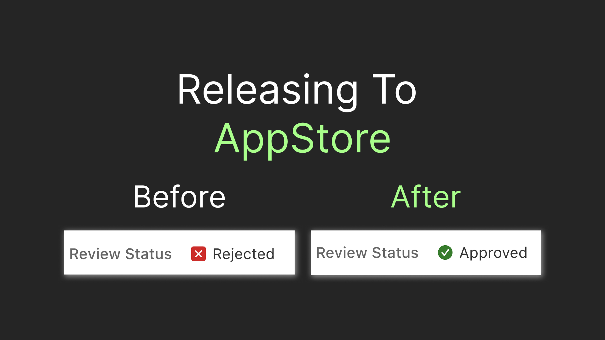
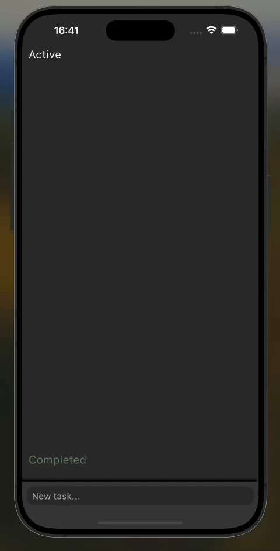
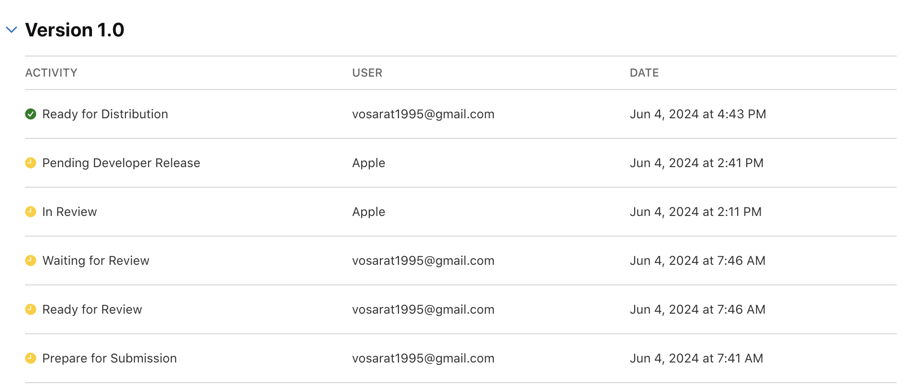
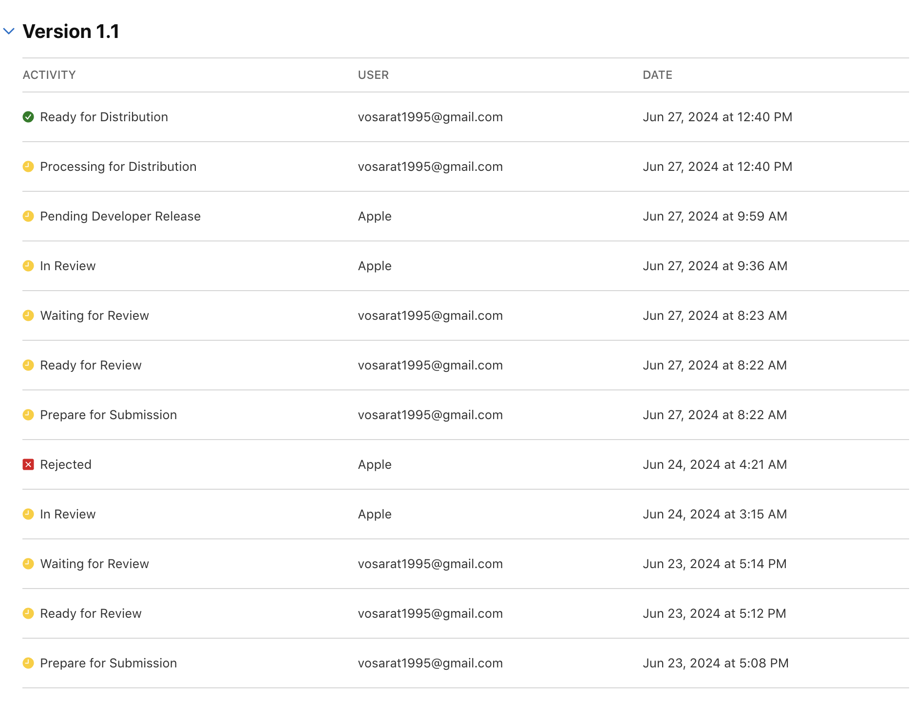
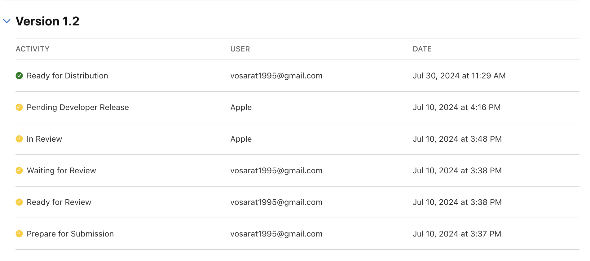

# Releasing a Flutter IOS App: My AppStore Story

My app [Finrir](https://apps.apple.com/us/app/finrir/id6472634631) was recently granted a spot among 1.8 million other AppStore apps. I have even released a few updates afterward. But I've walked a surprisingly long journey to get here. In this article, I'll share my experience and shed light on what one can expect when publishing an app to AppStore.



## First Attempt: Tasky

The story actually starts from another creation of mine - a simple to-do list app, I called `Tasky`. My plan was to create a minimalistic to-do list, ship it to AppStore as quickly as possible, learn the process and decide on the next steps based on that. This is what the app looked like in a nutshell:



Two days after I send the app to review I received a rejection letter. The letter listed two reasons for the rejection:

> ## Guideline 2.3.10 - Performance - Accurate Metadata
> 
> We noticed your submission includes irrelevant references to your app’s development process. 
> 
> Specifically, your screenshots includes debug banners.


That reason made sense since I forgot to remove the annoying flutter debug banner. This was reasanable and easy to fix. But the second rejection reason was much more disturbing:

> ## Guideline 4.3 - Design
> 
> We noticed that your app provides the same feature set as other apps submitted to the App Store; it simply varies in content or language, which is considered a form of spam.

Although, I agree my app didn't have a unique feature set the reason seems to be too arbitrary. The app wasn't supposed to be very unique, but it wasn't just varying in content or language - it has it's own user experience. It just seems that Apple should have a more sophisticated reason to reject an app, having in mind that I'm paying for the developer subscription. I received the rejection in July. After the rejection I decided to focus on the main app in the story and it took me 5 month to prepare to send an app to review one more time.

## The Freezing Winter

Submitted: Dec 9

Rejected: 2023-12-11

```
Hello,

Thank you for submitting your app for review.

We need additional time to evaluate your submission and Apple Developer Program account. Your submission status will appear as "Rejected" in App Store Connect while we investigate. However, we do not require a revised binary or additional information from you at this time.

While there may be a delay due to high submission volumes, we are working to complete our review as soon as possible. If we notice any issues that require your attention, we will let you know via App Store Connect. If we find no issues with your submission or account, the submission will be approved.

We will notify you as soon as there is new information to share. Other review inquiries may be filed via the Apple Developer Contact Us page.
```

Which sounds a little absurd.

Resubmitted with tiny update Jan 14, 2024.

2024-02-16

```
## Guideline 5.1.1(v) - Data Collection and Storage

We noticed that your app supports account creation but does not appear to include an option to initiate account deletion. 

Apps that support account creation must also offer account deletion to give App Store users more control of the data they've shared while using your app.
```

Which is a valid point.

```
## Guideline 5.1.1 - Legal - Privacy - Data Collection and Storage

We noticed that your app requires users to register or log in to access features that are not account based.

Apps may not require users to enter personal information to function, except when directly relevant to the core functionality of the app or required by law. For example, an e-commerce app should let users browse store offerings and other features that are not account based before being asked to register, or a restaurant app should allow users to explore the menu before placing an order. Registration must then only be required for account-specific features, such as saving items for future reference or placing an order.
```

Which is also fair.

## The Summer Boom

Send to Review: Jun 4, 2024 at 7:46 AM

Ready for Distribution: Jun 4, 2024 at 4:43 PM







## This is Where We Are Now

This is my experience with AppStore, so far. I couldn't say it was very friendly, but it wasn't hostile either. The future holds a lot more releases, so let's see what else I'll figure out about AppStore releases. I'll probably write another article if something interesting pops up ... for now, claps are appreciated! 👏
