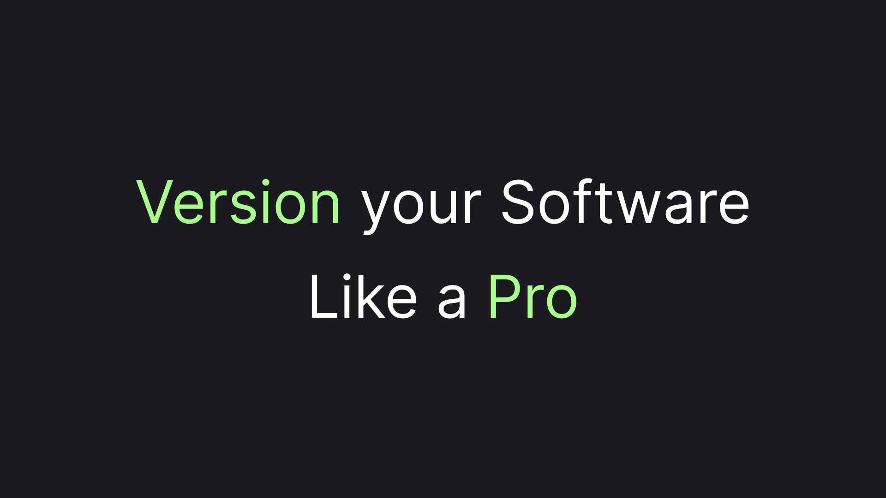
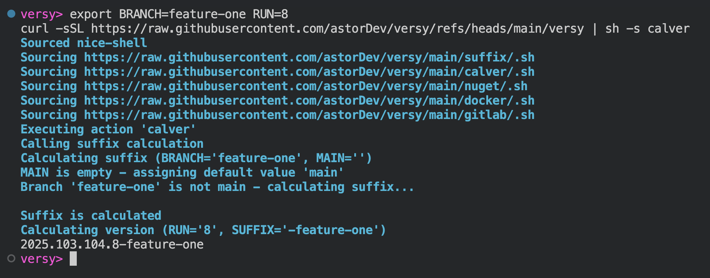
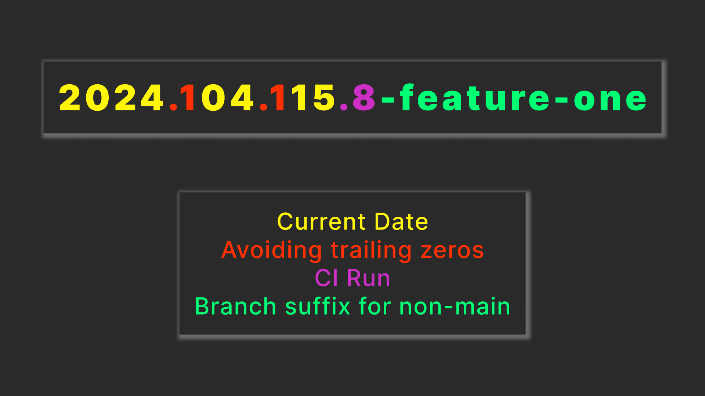
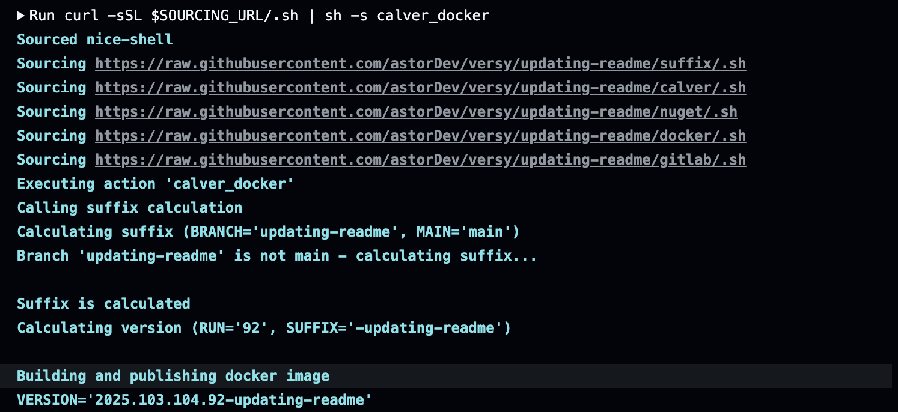
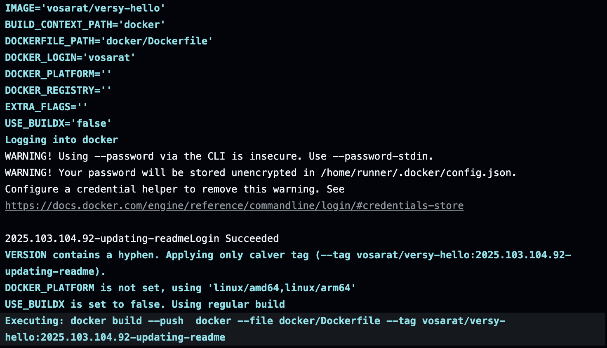
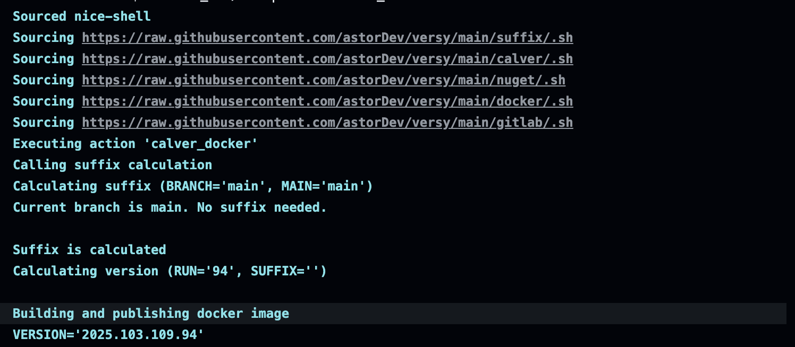
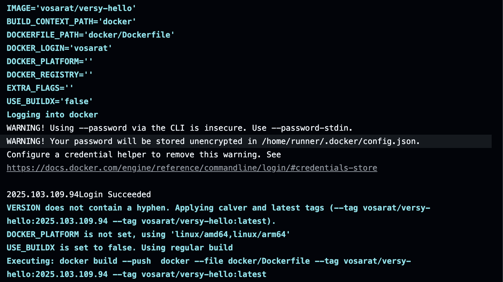

# Making Versioning Easy: A Smarter Approach to Software Releases

> Discover how CalVer—a time-based versioning technique—can simplify your release process, and learn how to automate it in a GitHub Actions CI pipeline for Docker image tagging.



Today, most software projects rely on **Semantic Versioning (SemVer)** to manage releases. While SemVer is widely adopted, it comes with its own set of challenges: constant manual tracking of version numbers, arbitrary decisions about release sizes, and the mental overhead of deciding whether a change is a 'major,' 'minor,' or 'patch.'

But what if there was a versioning style that didn’t require you to spend time overthinking releases—one that was both easy to remember and informative? Enter **Calendar Versioning (CalVer)**, a simpler, time-based approach that takes the guesswork out of versioning. In this article, we’ll explore how CalVer works and demonstrate its power by automating it in a GitHub Actions CI pipeline to tag Docker images.

## An Example CalVer Version

A picture is worth a thousand words and so is an example. Let's call a remote script generating a calver version for us:

```sh
export BRANCH=feature-one RUN=8
curl -sSL https://raw.githubusercontent.com/astorDev/versy/refs/heads/main/versy | sh -s calver
```

Here's an example of what we might get in return:



As you see, we've generated a version number, which indicates the day the version was generated, along with `RUN` number to differentiate versions in case we were building multiple that day and `BRANCH` name, which is appended if the branch is not `MAIN` to indicate a preview version.

What's great about that version is that it is SemVer-compatible and alphabetical, making it suitable for practically any of the systems involving versions. We've prepended one `1` to the month and day number specifically for it to stay both alphabetically-sortable and SemVer compatible, i.e. systems like Nuget don't differentiate between `01` and just `1`.

Here's the same explanation as a picture:



Although the version is SemVer-compatible, we didn't have any complications from a real SemVer versioning. We didn't have to think about whether our changes were breaking or not, how significant the changes were, and whether we should stay in beta with `0.x` or not.

That seamless versioning is especially useful for internal packages, images, and stuff like that, when we are fully aware of the state of our dependencies and the speed of iteration is more important for us than the stability of the integration.

## A Practical Example: GitHub Action for Docker Images

An example is worth a thousand words, but a practical example is worth a thousand more. CalVer can be used to build and publish a Docker image via a GitHub Action by path `astorDev/versy/calver/docker@main`.

Let's say we are building a `service-a` image, placed in the `service-a` folder of our repository. Let's place a workflow in the GitHub autodiscovery folder and name it `service-a-image.yml` - our full path would be `.github/workflows/service-a-image.yml`.

We can build an image every time we encounter a `push` to either the workflow file or to the folder `service-a` containing our imaginary project files. Let's also allow manual run by `workflow_dispatch` event.

We'll have just a single job with a single step, that will use the base action we've talked about. Here's how our workflow file head would look like:

```yaml
on:
  push:
    paths:
      - '.github/workflows/service-a-image.yml'
      - 'service-a/**'
  workflow_dispatch:

jobs:
  publish:
    runs-on: ubuntu-latest
    steps:
      - uses: astorDev/versy/calver/docker@main
        with:
            # ...
```

Let's now fill the required properties. First of all, we'll need a DockerHub account. Creating a DockerHub account is out of the scope of this article, so let's just imagine we've created an account with the name `my-docker-name`. We'll need to authorize in Docker, so let's also imagine we are storing `DOCKER_PASSWORD` in the github project secrets.

Here's the argument values we will get:

```yaml
image: 'my-docker-name/service-a'
docker-login: my-docker-name
docker-password: ${{ secrets.DOCKER_PASSWORD }}
```

Next, we'll need to specify the docker build file and context. As we already imagined, our code, including the `Dockerfile`, is residing inside a `service-a` folder, therefore the rest of our arguments will look like that:

```yaml
build-context-path: 'service-a'
dockerfile-path: 'service-a/Dockerfile'
```

Here's how our workflow file will look once assembled:

```yaml
on:
  push:
    paths:
      - '.github/workflows/service-a.yml'
      - 'service-a/**'
  workflow_dispatch:
    
jobs:
  publish:
    runs-on: ubuntu-latest
    steps:
      - uses: astorDev/versy/calver/docker@main
        with:
          image: 'my-docker-name/service-a'
          docker-login: my-docker-name
          docker-password: ${{ secrets.DOCKER_PASSWORD }}
          build-context-path: 'service-a'
          dockerfile-path: 'service-a/Dockerfile'
```

To build our workflow fast, we've utilized our imagination. Unfortunately, imagination can't really run a workflow. Instead, I'll show you logs of an example workflow, from the same project that our base GitHub action is.

> You can find the actual workflow file [here on GitHub](https://github.com/astorDev/versy/blob/main/.github/workflows/calver-docker.yaml)

The first part we'll see will be our already available logs of building a calver version:



Next part will build a docker image with the specified version and push it to the registry:



As you may have noticed 



Some registries (for example the one for NuGet) automatically consider a version with a trailing `-` as a preview version and others as a "stable" version. There's no such concept in docker images, though. Instead there's a concept of a `latest` tag. The `calver-docker` action automatically attaches the tag when a version doesn't have a prefix:



This is everything to see about building a Docker image with calver. Let's wrap it up and call it a day!

## Wrapping Up!

Versioning doesn’t have to be complicated. While SemVer has been the go-to approach for years, it often comes with unnecessary overhead—forcing developers to manually track versions and arbitrarily decide release sizes. CalVer, on the other hand, offers a simpler, time-based alternative that eliminates the guesswork and keeps your versioning process clean and intuitive.

In this article, we explored how CalVer works, why it’s a great fit for modern software projects, and even used it in a GitHub Actions CI pipeline to tag Docker images. Whether you’re managing a fast-paced project or just looking to streamline your release process, CalVer might be the versioning strategy you’ve been missing.

The Github Action we used is part of a project called Versy. Check it out [here on GitHub](https://github.com/astorDev/versy). Don't hesitate to give it a star! ⭐

And also... claps are appreciated! 👉👈
