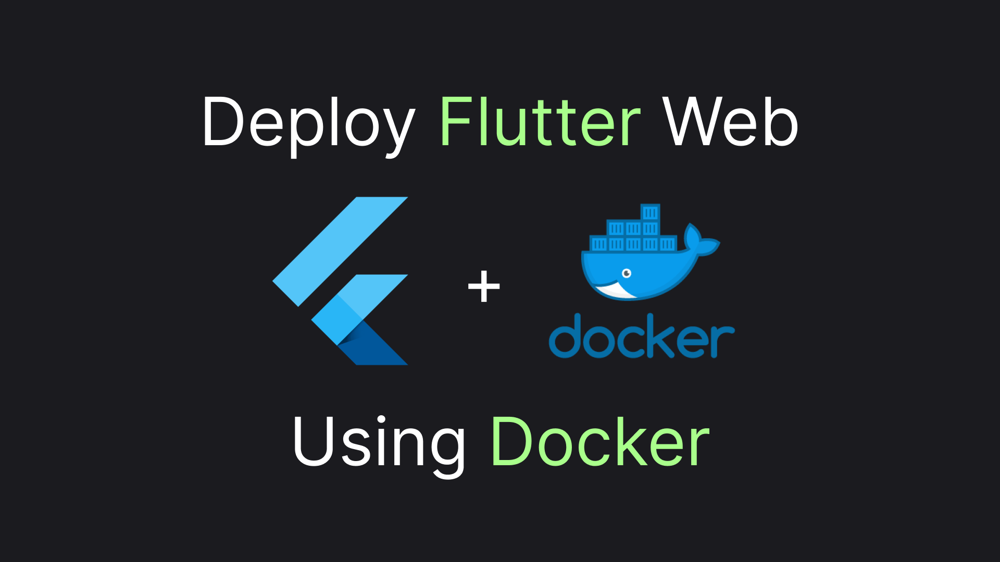

# Deploying Flutter Web with Docker

In March 2021, Flutter 2.0 included support for the web as a target platform. Still, there's no clear official instruction on how to set it up with a de-facto standard platform for web applications deployment - docker. In this article, we'll investigate how to make those two play nicely together. Without further ado, let's get to code!

> Or jump straight to the [TLDR](#tldr) to find an example setup.



## Naive Implementation: Nginx Only Image

```sh
flutter build web
```

`Dockerfile`: 

```dockerfile
FROM nginx
COPY /build/web /usr/share/nginx/html
```

`compose.yml`

```yaml
services:
  example:
    build: .
    ports:
      - "4444:80"
```

```sh
docker compose up -d --build
```

`localhost:4444`

## Full Dockerfile: Building Hosting Files  

```dockerfile
FROM ubuntu AS build

RUN apt-get update
RUN apt-get install -y curl git unzip

RUN git clone https://github.com/flutter/flutter.git 

ENV PATH="/flutter/bin:${PATH}"
```

```dockerfile
COPY . /app
WORKDIR /app
RUN flutter clean
RUN flutter build web
```

```dockerfile
FROM nginx
COPY --from=build /app/build/web /usr/share/nginx/html
```

```dockerfile
FROM ubuntu AS build

RUN apt-get update
RUN apt-get install -y curl git unzip

RUN git clone https://github.com/flutter/flutter.git 

ENV PATH="/flutter/bin:${PATH}"

COPY . /app
WORKDIR /app
RUN flutter clean
RUN flutter build web

FROM nginx
COPY --from=build /app/build/web /usr/share/nginx/html
```

## Using Base Build Image

```dockerfile
RUN flutter doctor -v
RUN flutter build web || echo "expected fail (build triggered to preload web sdk)"
```

```dockerfile
FROM ubuntu AS build

RUN apt-get update
RUN apt-get install -y curl git unzip

RUN git clone https://github.com/flutter/flutter.git 

ENV PATH="/flutter/bin:${PATH}"

RUN flutter doctor -v
RUN flutter build web || echo "expected fail (build triggered to preload web sdk)"
```

`vosarat/flutter`

## TLDR

This article sheds light on creating a dockerfile for your Flutter web app. Here's a short snippet of the final version:

```dockerfile
FROM vosarat/flutter AS build

COPY . /app
WORKDIR /app 
RUN flutter clean 
RUN flutter build web

FROM nginx
COPY --from=build /app/build/web /usr/share/nginx/html
```

The version utilizes a base image from my docker registry. You can find the source code for it in the dedicated [repository folder](https://github.com/astorDev/versy/tree/main/flutter) and, by the way ... claps are appreciated! 👏
